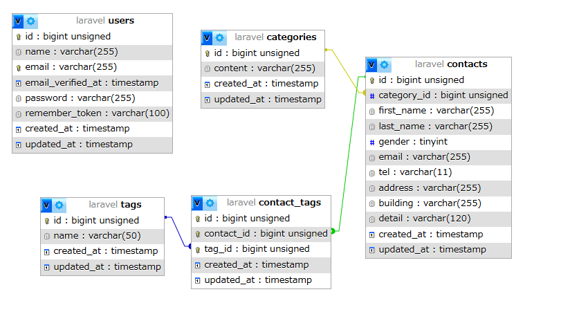

#　COACHTECHお問い合わせフォーム

##　概要

お問い合わせフォームアプリです。

ユーザーはお問い合わせを送信でき、
管理者はお問い合わせ内容の検索・閲覧・削除を行うことができます。

##　作成した機能

- お問い合わせフォーム
- 確認ページ
- サンクスページ
- 管理画面
- お問い合わせ検索
- お問い合わせ詳細表示
- お問い合わせ削除

##　ER図

##　使用技術

- PHP 8.1
- Laravel 10
- MySQL 8.0
- Docker
- phpMyAdmin

##　環境構築

### Dockerビルド

docker-compose up =d --build

### Laravel環境構築

composer install

cp .env.example .env

php artisan key:generate

php artisan migrate

php artisan db:seed

##　APIエンドポイント一覧

未実装

##　開発環境URL

開発環境:http://localhost/

phpMyAdmin:http://localhost:8080/

##　作成者

榎田　史保